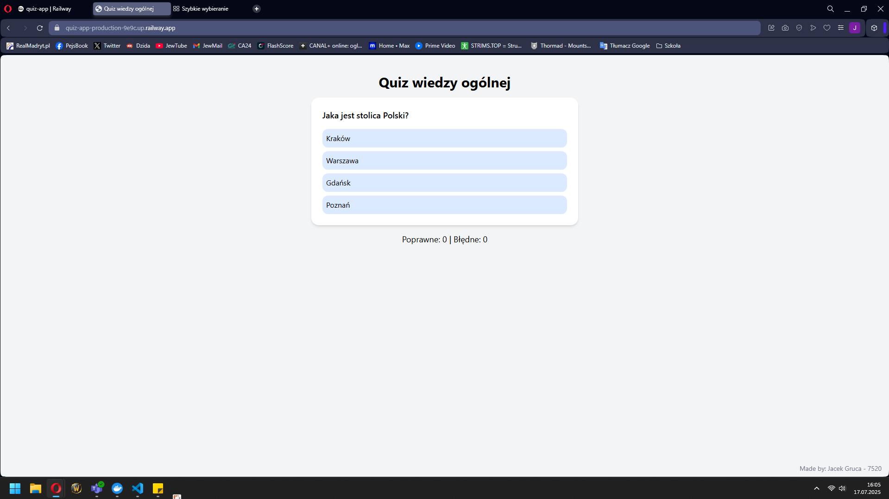
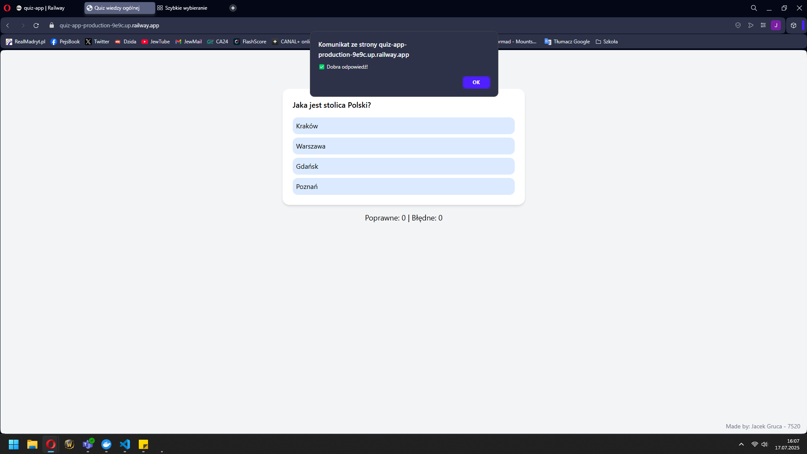
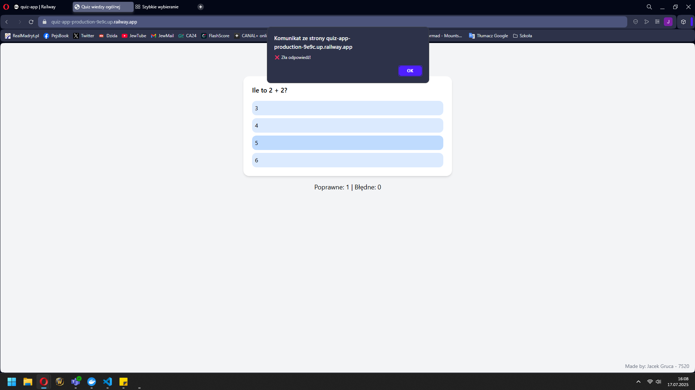
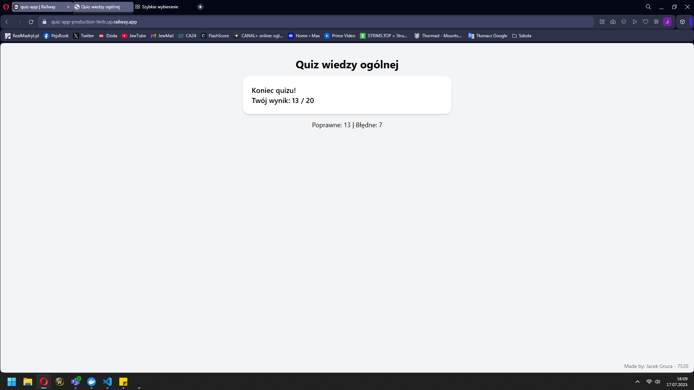
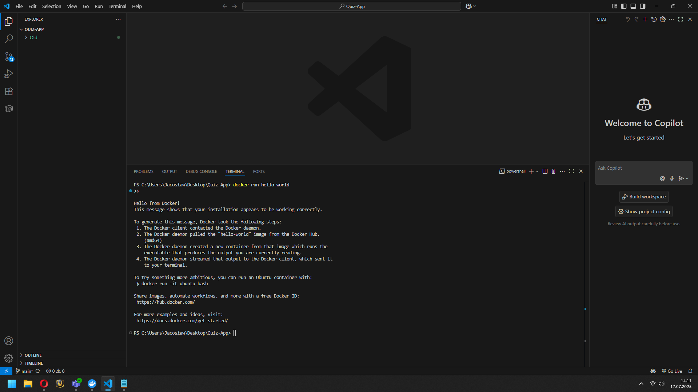
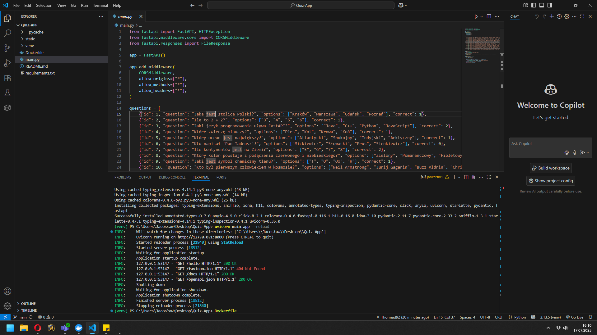
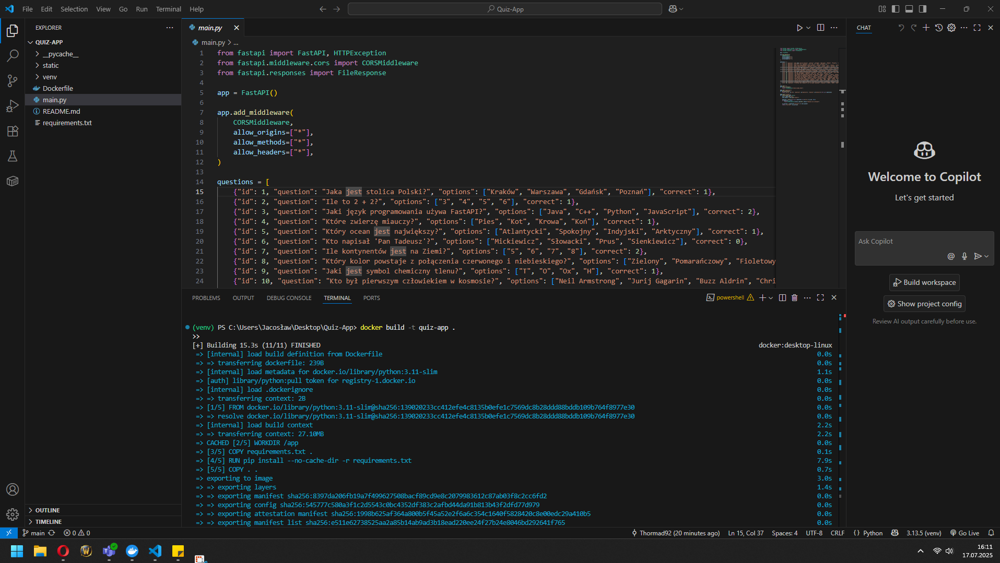
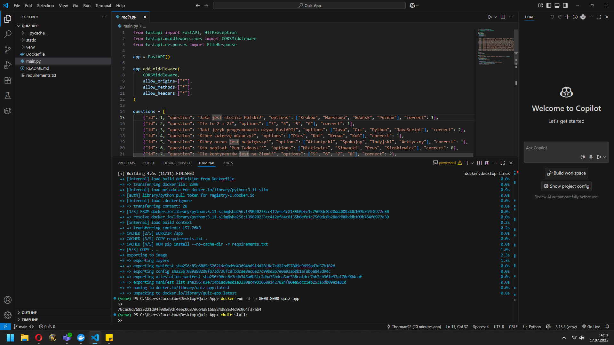

# Quiz App – Projekt semestralny

Aplikacja chmurowa zbudowana w FastAPI + HTML + Tailwind CSS, uruchomiona w Railway.

## Autor

**Jacek Gruca – 7520**

---

## Funkcjonalności

- 20 pytań z wiedzy ogólnej
- 4 odpowiedzi do wyboru
- Informacja czy odpowiedź była poprawna
- Licznik poprawnych i błędnych odpowiedzi
- Podpis autora na stronie
- Hosting w Railway
- Docker + FastAPI + Tailwind

---

## Zrzuty ekranu

### Ekran startowy quizu/przykład pytania z odpowiedziami

### Informacja o poprawnej odpowiedzi

### Informacja o niepoprawnej odpowiedzi

### Koniec quizu – wynik końcowy

---

## Jak uruchomić lokalnie?

git clone https://github.com/Thormad92/quiz-app.git
cd quiz-app
docker build -t quiz-app .
docker run -d -p 8000:8000 quiz-app

Potem otwórz:
http://localhost:8000